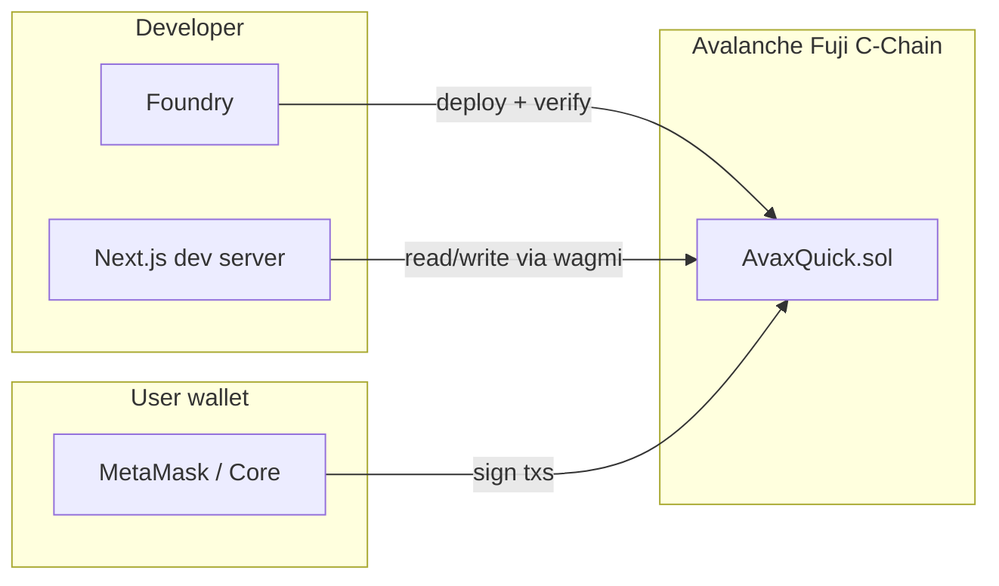

# AvaxQuick — Avalanche ERC-20 Starter

A production-ready Avalanche C-Chain project: **AvaxQuick (AXQ)** ERC-20 smart contract, Foundry test suite, deployment pipeline, and a Next.js wallet dashboard. Includes AI agent configuration for Cursor and Claude Code.

## What This Project Includes

| Layer | Technology | Purpose |
|-------|------------|---------|
| Smart contract | Solidity 0.8.24, OpenZeppelin v5 | `AvaxQuick` ERC-20 with permit, votes, and role-based minting |
| Toolchain | Foundry (forge/cast/anvil) | Build, test, deploy, verify on Snowtrace |
| Frontend | Next.js 16, wagmi, RainbowKit | Fuji testnet dashboard — connect wallet, transfer, burn |
| CI/CD | GitHub Actions | Build, fuzz/invariant tests, coverage, Slither, secrets scan |
| AI tooling | `.cursorrules`, `CLAUDE.md`, `SKILL.md` | Agent rules and Avalanche builder playbook |

## Architecture



## Prerequisites

- [Foundry](https://book.getfoundry.sh/getting-started/installation) — `curl -L https://foundry.paradigm.xyz | bash && foundryup`
- [Node.js](https://nodejs.org/) 20+ (for the frontend)
- A wallet with [Fuji test AVAX](https://faucet.avax.network) (C-Chain)
- [WalletConnect Cloud](https://cloud.walletconnect.com) project ID (for RainbowKit)
- Optional: [Snowtrace API key](https://snowtrace.io/myapikey) for contract verification

## Quick Start

### 1. Clone and install dependencies

```bash
git clone <your-repo-url>
cd AVAX_QuickStart

# Foundry dependencies (OpenZeppelin, forge-std)
forge install

# Frontend
cd frontend && npm install && cd ..
```

### 2. Configure environment

```bash
# Root — deployment secrets (never commit)
cp .env.example .env
# Edit: PRIVATE_KEY, SNOWTRACE_API_KEY

# Frontend — wallet + deployed contract address
cp frontend/.env.local.example frontend/.env.local
# Edit: NEXT_PUBLIC_WALLETCONNECT_PROJECT_ID
```

### 3. Build and test contracts

```bash
forge build
forge test -vvv
forge coverage
```

Confirm compile output shows `evm_version = cancun`. This is **required** — Avalanche does not support Solidity's default Pectra EVM (≥0.8.30).

### 4. Deploy to Fuji

```bash
# Dry-run first (no on-chain tx)
forge script script/Deploy.s.sol --rpc-url fuji

# Broadcast + verify
forge script script/Deploy.s.sol \
  --rpc-url fuji \
  --broadcast \
  --verify
```

Copy the deployed address from the console output into `frontend/.env.local`:

```env
NEXT_PUBLIC_AVAX_QUICK_ADDRESS=0xYourDeployedAddress
```

### 5. Sync ABI and run the frontend

```bash
cd frontend
npm run sync-abi   # copies ABI from forge build output
npm run dev
```

Open [http://localhost:3000](http://localhost:3000), connect MetaMask or Core Wallet, switch to **Avalanche Fuji** (chain ID `43113`), and interact with AXQ.

## Project Structure

```
AVAX_QuickStart/
├── src/
│   └── AvaxQuick.sol          # ERC-20 token contract
├── test/
│   ├── AvaxQuick.t.sol        # Unit, fuzz, invariant tests
│   ├── AvaxQuickHandler.sol   # Invariant handler
│   └── Deploy.t.sol           # Deploy script smoke test
├── script/
│   └── Deploy.s.sol           # Fuji/mainnet deployment
├── frontend/
│   ├── src/
│   │   ├── app/               # Next.js App Router pages
│   │   ├── components/        # TokenDashboard, Providers
│   │   ├── config/            # wagmi + contract address
│   │   └── abi/               # Generated ABI (sync-abi)
│   └── scripts/sync-abi.mjs   # ABI sync from Foundry artifacts
├── lib/                       # forge deps (git submodules)
├── foundry.toml               # Avalanche config (evm_version = cancun)
├── .github/workflows/         # CI pipeline
├── .cursorrules               # Cursor agent rules
├── CLAUDE.md                  # Claude Code instructions
├── SKILL.md                   # Full Avalanche builder playbook
├── AI-PROMPT-LIBRARY.md       # Copy-paste AI prompts
└── HOW_TO.md                  # Step-by-step walkthrough
```

## AvaxQuick Token (AXQ)

| Property | Value |
|----------|-------|
| Name / Symbol | AvaxQuick / AXQ |
| Decimals | 18 |
| Max supply | 1,000,000,000 AXQ |
| Extensions | ERC20Permit (gasless approvals), ERC20Votes (governance) |
| Access control | `DEFAULT_ADMIN_ROLE`, `MINTER_ROLE` |
| Public functions | `mint` (minter only), `burn` (any holder) |

Initial deploy mints **100,000,000 AXQ** (10% of max supply) to the deployer.

### Networks

| Network | Chain ID | RPC |
|---------|----------|-----|
| Fuji Testnet | 43113 | `https://api.avax-test.network/ext/bc/C/rpc` |
| C-Chain Mainnet | 43114 | `https://api.avax.network/ext/bc/C/rpc` |

**Always develop and validate on Fuji before mainnet.**

## Common Commands

### Foundry

```bash
forge build                                    # compile
forge test -vvv                                # all tests
forge test --match-test testFuzz -vvv          # fuzz only
forge test --match-test testInvariant -vvv     # invariant only
forge coverage --report summary                # coverage
forge snapshot                                 # gas snapshot
slither . --print human-summary                # security scan

# Cast — read on-chain state
cast call <ADDR> "symbol()(string)" --rpc-url $FUJI_RPC_URL
cast call <ADDR> "balanceOf(address)(uint256)" <WALLET> --rpc-url $FUJI_RPC_URL
```

### Frontend

```bash
cd frontend
npm run dev          # development server
npm run build        # production build
npm run sync-abi     # refresh ABI after contract changes
npm run lint         # ESLint
```

## Security

- **Never commit** `.env` or `frontend/.env.local` — both are gitignored
- **Never hardcode** private keys in source files
- Use **EIP-1559** transactions on C-Chain (`maxFeePerGas` ≥ 25 gwei after Octane)
- Run **Slither** before any deployment: `slither . --print human-summary`
- CI enforces: `evm_version = cancun`, fuzz tests, Slither high-severity gate, secrets scan

### Pre-deploy checklist

- [ ] `foundry.toml` has `evm_version = "cancun"`
- [ ] `forge test` — 100% passing
- [ ] `forge coverage` — ≥90% line coverage
- [ ] Slither — no unresolved HIGH/MEDIUM findings
- [ ] Dry-run deploy on Fuji without `--broadcast`
- [ ] Broadcast + verify on Fuji Snowtrace
- [ ] Frontend tested against Fuji deployment
- [ ] Mainnet deploy only after Fuji validation

## CI/CD

The workflow at `.github/workflows/avalanche-ci.yml` runs on push/PR to `main` and `develop`:

1. **Build & test** — compile, unit/fuzz/invariant tests, coverage, gas snapshot
2. **Security** — Slither static analysis
3. **Secrets check** — scan for exposed private keys, verify `.gitignore`
4. **Dry-run deploy** — Fuji deploy simulation (main branch only; requires `FUJI_DEPLOY_KEY` secret)

## AI-Assisted Development

This repo is optimized for AI coding agents:

| File | Use with |
|------|----------|
| `.cursorrules` | Cursor, Windsurf, Continue.dev |
| `CLAUDE.md` | Claude Code |
| `SKILL.md` | Full Avalanche playbook (L1s, ICM, security, deployment) |
| `AI-PROMPT-LIBRARY.md` | Copy-paste prompts for scaffolding, audits, deploys |
| `frontend/AGENTS.md` | Frontend-specific agent rules |

See [HOW_TO.md](./HOW_TO.md) for a complete walkthrough from zero to running dApp.

## Documentation Index

| Document | Description |
|----------|-------------|
| [README.md](./README.md) | This file — project overview and quick start |
| [HOW_TO.md](./HOW_TO.md) | Detailed step-by-step setup and deployment guide |
| [CLAUDE.md](./CLAUDE.md) | Claude Code workflow, commands, security checks |
| [SKILL.md](./SKILL.md) | Comprehensive Avalanche builder skill (1000+ lines) |
| [AI-PROMPT-LIBRARY.md](./AI-PROMPT-LIBRARY.md) | Ready-to-use AI prompts |
| [frontend/README.md](./frontend/README.md) | Frontend architecture and development |
| [.cursorrules](./.cursorrules) | Cursor agent rules (auto-loaded) |

## Resources

- [Avalanche Builder Hub](https://build.avax.network)
- [Foundry Book](https://book.getfoundry.sh)
- [Fuji Faucet](https://faucet.avax.network)
- [Snowtrace (Fuji)](https://testnet.snowtrace.io)
- [OpenZeppelin Contracts v5](https://docs.openzeppelin.com/contracts/5.x/)

## License

MIT — see individual file headers for SPDX identifiers.
